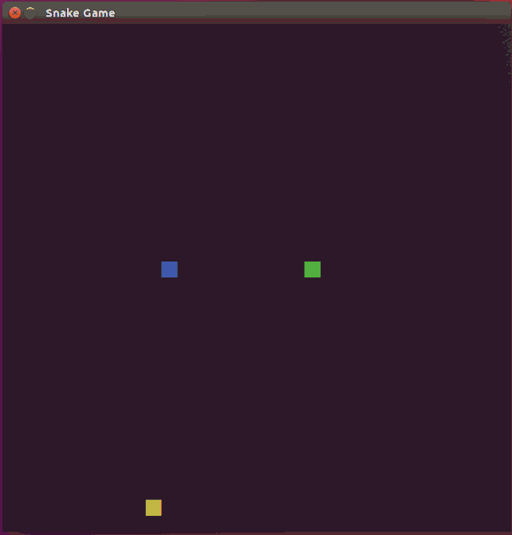

# CPPND: Capstone - 2-Player Snake Game

This is my Capstone project for the [Udacity C++ Nanodegree Program](https://www.udacity.com/course/c-plus-plus-nanodegree--nd213).

The starting point for this project is a [simple snake clone](https://github.com/udacity/CppND-Capstone-Snake-Game), to which I have added a number of features.

## Dependencies for Running Locally
* cmake >= 3.7
  * All OSes: [click here for installation instructions](https://cmake.org/install/)
* make >= 4.1 (Linux, Mac), 3.81 (Windows)
  * Linux: make is installed by default on most Linux distros
  * Mac: [install Xcode command line tools to get make](https://developer.apple.com/xcode/features/)
  * Windows: [Click here for installation instructions](http://gnuwin32.sourceforge.net/packages/make.htm)
* SDL2 >= 2.0
  * All installation instructions can be found [here](https://wiki.libsdl.org/Installation)
  * Note that for Linux, an `apt` or `apt-get` installation is preferred to building from source.
* gcc/g++ >= 5.4
  * Linux: gcc / g++ is installed by default on most Linux distros
  * Mac: same deal as make - [install Xcode command line tools](https://developer.apple.com/xcode/features/)
  * Windows: recommend using [MinGW](http://www.mingw.org/)

## Basic Build Instructions

1. Clone this repo.
2. Make a build directory in the top level directory: `mkdir build && cd build`
3. Compile: `cmake .. && make`
4. Run it: `./SnakeGame`.

## Added features / refactorings

- [x] Fix food placement bug
  - In the starter code, the food could sometimes be placed at x and/or y coordinate of 32, which is outside of the grid (given that the 32x32 grid coords are zero-indexed).
  - I corrected this "off by one" error.
- [x] Move direction change logic into snake class
  - Changing direction, and determining whether a change in a particular direction is possible, is more appropriately encapsulated within the snake class.
  - I also created a helper method `Snake::OppositeDirection()` to encapsulate the logic of determining the opposite of a Snake::Direction value.
  - Following these changes, it was possible to make the `Snake::direction` member private.
- [x] Second snake
  - The adversary snake is a user controlled snake controlled using the w/a/s/d keys.
  - It has a green head to differentiate from the primary user.
  - Each snake has its own score that is displayed in the title bar and and the end of the same.
  - If a snake crashes into another snake, it dies. The snake that has been crashed into continues (unless they both crashed into each other's head).
  - A dead snake remains as an obstacle for the other snake.
  - The game continues until both snakes are dead.
- [ ] Expiring food
- [ ] High score
- [ ] Parallelize updates to snake and food

## Rubric

<table>
  <thead>
    <tr>
      <th>Feature / refactoring</th>
      <th>Rubric criteria satisfied</th>
      <th>Evidence</th>
    </tr>
  </thead>
  <tbody>
    <tr>
      <td rowspan="5">Expiring food</td>
      <td>The project uses Object Oriented Programming techniques.</td>
      <td>
        <a href="https://github.com/samfrances/CppND-Capstone-Snake-Game/commit/609f7f71db57cbc628d1b3c34b6e2d0d7c04b618">here</a>
      </td>
    </tr>
    <tr>
      <td>Classes use appropriate access specifiers for class members.</td>
      <td>
        <a href="https://github.com/samfrances/CppND-Capstone-Snake-Game/commit/609f7f71db57cbc628d1b3c34b6e2d0d7c04b618#diff-2a8a6c0d90317541e8c7cabd5076c1f5">here</a>
      </td>
    </tr>
    <tr>
      <td>Class constructors utilize member initialization lists.</td>
      <td>
        <a href="https://github.com/samfrances/CppND-Capstone-Snake-Game/commit/609f7f71db57cbc628d1b3c34b6e2d0d7c04b618#diff-2a8a6c0d90317541e8c7cabd5076c1f5R10-R14">here</a>
      </td>
    </tr>
    <tr>
      <td>Classes abstract implementation details from their interfaces.</td>
      <td></td>
    </tr>
    <tr>
      <td>Classes encapsulate behavior.</td>
      <td></td>
    </tr>
    <tr>
      <td rowspan="2">High Score</td>
      <td>The project reads data from a file and process the data, or the program writes data to a file.</td>
      <td></td>
    </tr>
    <tr>
      <td>The project demonstrates an understanding of C++ functions and control structures.</td>
      <td></td>
    </tr>
    <tr>
      <td rowspan="3">Second snake</td>
      <td>The project accepts user input and processes the input.</td>
      <td>
        <a href="https://github.com/samfrances/CppND-Capstone-Snake-Game/commit/496742b1748a98dc97b6003de16fbfb26ceb1905#diff-52537bb6a6d31158dba678bd0d88541aR29-R43">here</a>
      </td>
    </tr>
    <tr>
      <td>The project makes use of references in function declarations.</td>
      <td>
        <a href="https://github.com/samfrances/CppND-Capstone-Snake-Game/commit/496742b1748a98dc97b6003de16fbfb26ceb1905#diff-8489e9017bfe9a3e03b2c4b94f61c474R28">here</a> and
        <a href="https://github.com/samfrances/CppND-Capstone-Snake-Game/commit/496742b1748a98dc97b6003de16fbfb26ceb1905#diff-8489e9017bfe9a3e03b2c4b94f61c474R33">here</a>
      </td>
    </tr>
    <tr>
      <td>Class constructors utilize member initialization lists.</td>
      <td>
        <a href="https://github.com/samfrances/CppND-Capstone-Snake-Game/commit/496742b1748a98dc97b6003de16fbfb26ceb1905#diff-18513665750ef5adf42b5ec29e14162eR7">here</a>
      </td>
    </tr>
    <tr>
      <td rowspan="2">Parallelize updates to snake(s) and food</td>
      <td>The project uses multithreading.</td>
      <td></td>
    </tr>
    <tr>
      <td>A mutex or lock is used in the project.</td>
      <td></td>
    </tr>
    <tr>
      <td rowspan="4">Move direction change logic into snake class</td>
      <td>Classes encapsulate behavior.</td>
      <td>
        <a href="https://github.com/samfrances/CppND-Capstone-Snake-Game/commit/b1d15bad201cf8024827a43c678cb6cd2ea6a45d#diff-52537bb6a6d31158dba678bd0d88541a">here</a> and
        <a href="https://github.com/samfrances/CppND-Capstone-Snake-Game/commit/b1d15bad201cf8024827a43c678cb6cd2ea6a45d#diff-5724de0b1684b15a68f2e893a80b0ddc">here</a>
      </td>
    </tr>
    <tr>
      <td>The project uses Object Oriented Programming techniques.</td>
      <td>
        <a href="https://github.com/samfrances/CppND-Capstone-Snake-Game/commit/b1d15bad201cf8024827a43c678cb6cd2ea6a45d#diff-52537bb6a6d31158dba678bd0d88541a">here</a> and
        <a href="https://github.com/samfrances/CppND-Capstone-Snake-Game/commit/b1d15bad201cf8024827a43c678cb6cd2ea6a45d#diff-5724de0b1684b15a68f2e893a80b0ddc">here</a>
      </td>
    </tr>
    <tr>
      <td>Classes abstract implementation details from their interfaces.</td>
      <td>
        <a href="https://github.com/samfrances/CppND-Capstone-Snake-Game/commit/b1d15bad201cf8024827a43c678cb6cd2ea6a45d#diff-52537bb6a6d31158dba678bd0d88541a">here</a> and
        <a href="https://github.com/samfrances/CppND-Capstone-Snake-Game/commit/b1d15bad201cf8024827a43c678cb6cd2ea6a45d#diff-5724de0b1684b15a68f2e893a80b0ddc">here</a>
      </td>
    </tr>
    <tr>
      <td>The project demonstrates an understanding of C++ functions and control structures.</td>
      <td>
        <a href="https://github.com/samfrances/CppND-Capstone-Snake-Game/commit/b1d15bad201cf8024827a43c678cb6cd2ea6a45d#a-5724de0b1684b15a68f2e893a80b0ddcR82-R91">here</a>
      </td>
    </tr>
  </tbody>
</table>

## Project structure

The project structure hasn't changed significantly from the [starter project](https://github.com/udacity/CppND-Capstone-Snake-Game).
Most changes have taken place within the context of that structure.

A full diff can be viewed [here](https://github.com/samfrances/CppND-Capstone-Snake-Game/compare/starting_point...samfrances:master).
